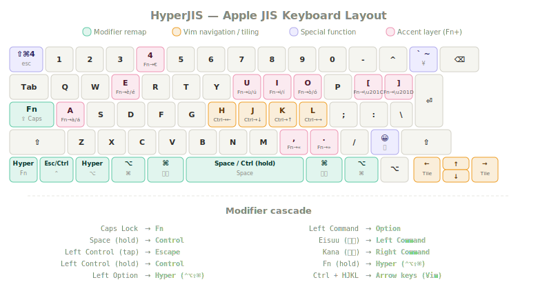

# HyperJIS

A Karabiner-Elements config that uses the extra keys on an Apple JIS keyboard to build a US-compatible layout with a Hyper key, Vim navigation, window tiling, and modular accent support for Italian, French, Spanish, and German.



---

## Why this exists

A US ANSI keyboard doesn't have enough keys. If you want a Hyper key (⌃⌥⇧⌘), Vim-style navigation, window tiling shortcuts, and accented characters for a second language, you run out of room. Something has to give. You end up with layers of hacks competing for the same modifier keys, or you buy a custom mechanical board with extra thumb clusters.

I went a different direction. Apple's JIS keyboard has more keys than ANSI: two extra keys flanking the spacebar (Eisuu and Kana), an extra key above Return (¥), and another near right Shift. Nobody uses them on a US-oriented setup. I do. Those keys give me dedicated Command under both thumbs, a real Hyper key, and room for an accent layer, all while keeping a standard US arrangement for coding and macOS shortcuts.

The other reason I chose JIS: Apple makes them for every product line. Magic Keyboard, MacBook Pro, MacBook Air. You can order one anywhere in the world. I use the same physical keyboard at my desk and at work, with blank black stickers over every keycap. No labels, no peeking. Pure muscle memory. Install Karabiner on any Mac, import the config, and the layout is identical in two minutes.

I've been using this setup for years. I called it HyperJIS.

## What it does

### Core layout (`hyperjis-core.json`)

| Physical key | What it becomes |
|---|---|
| Caps Lock | Fn |
| Space (hold) | Control |
| Left Control (tap) | Escape |
| Left Control (hold) | Control |
| Left Option | Hyper (⌃⌥⇧⌘) |
| Left Command | Left Option |
| Eisuu (英数) | Left Command |
| Kana (かな) | Right Command |
| Right Command | Right Option |
| Fn (tap) | Language switch |
| Fn (hold) | Hyper (⌃⌥⇧⌘) |
| Ctrl + H/J/K/L | Arrow keys (Vim) |
| ¥ (International3) | `` ` `` / `~` |
| International1 (ろ) | Emoji picker |
| Escape (tap) | Screenshot (⇧⌘4) |
| Escape (hold) | ⌃⌥⇧⌘W |
| Arrow keys | Fn+HJKL (frees arrows for tiling) |

The modifier cascade puts Command under your thumbs (Eisuu/Kana), Control under your right thumb (hold Space), Escape under your left pinky (tap Control), and Hyper under your left ring finger (Option). Your hands stay on the home row. If you also set macOS to map Caps Lock → Control (System Settings → Keyboard → Modifier Keys), Caps Lock becomes a second Escape/Control key alongside Left Control.

### Window tiling

With cursor movement handled by Ctrl+HJKL, the arrow keys are free. I use [Swish](https://highlyopinionated.co/swish/) to map modifier+arrow combos to tiling actions: halves, quarters, thirds, fullscreen. If you don't use Swish, disable the arrow remap rule and keep normal arrows.

### Accent system (modular)

The accent files are separate from the core layout. Pick the ones you need:

| File | What it adds | Trigger |
|---|---|---|
| `hyperjis-accents-romance.json` | Grave/acute on all vowels, €, «», "" | Fn + vowel (double-tap swaps grave↔acute) |
| `hyperjis-accents-french.json` | Circumflex (â, ê, î, ô, û), ç, œ | Fn + Option + vowel; Fn + c/q |
| `hyperjis-accents-spanish.json` | ñ, ¡, ¿ | Fn + n; Fn + 1; Fn + / |
| `hyperjis-accents-german.json` | Umlauts (ä, ö, ü), ß | Fn + Option + a/o/u; Fn + s |

**Which files for which language:**

| Language | Install these |
|---|---|
| Italian | Romance base |
| Spanish | Romance base + Spanish |
| French | Romance base + French |
| German | German (standalone, or add Romance base too) |
| Portuguese | Romance base |

The Romance base file handles grave and acute accents on all five vowels. That alone covers Italian completely, and gives Spanish and Portuguese their accented vowels. French and German each need one more file on top.

**Note:** The French and German extensions both use Fn + Option + vowel, so don't enable both at the same time. If you need both circumflex and umlauts, pick one extension and use macOS's built-in dead keys (Option+i or Option+u) for the other.

## Installation

You need macOS, [Karabiner-Elements](https://karabiner-elements.pqrs.org/), and a JIS Apple keyboard.

### Import into Karabiner

Copy any of these URLs and paste them into your browser's address bar. Karabiner-Elements will open and offer to import the rules.

**Core layout:**
```
karabiner://karabiner/assets/complex_modifications/import?url=https://raw.githubusercontent.com/smnrg/HyperJIS/main/json/hyperjis-core.json
```

**Romance base** (Italian, Spanish, Portuguese, French grave/acute):
```
karabiner://karabiner/assets/complex_modifications/import?url=https://raw.githubusercontent.com/smnrg/HyperJIS/main/json/hyperjis-accents-romance.json
```

**French extension** (circumflex, ç, œ):
```
karabiner://karabiner/assets/complex_modifications/import?url=https://raw.githubusercontent.com/smnrg/HyperJIS/main/json/hyperjis-accents-french.json
```

**Spanish extension** (ñ, ¡, ¿):
```
karabiner://karabiner/assets/complex_modifications/import?url=https://raw.githubusercontent.com/smnrg/HyperJIS/main/json/hyperjis-accents-spanish.json
```

**German extension** (ä, ö, ü, ß):
```
karabiner://karabiner/assets/complex_modifications/import?url=https://raw.githubusercontent.com/smnrg/HyperJIS/main/json/hyperjis-accents-german.json
```

After importing, open Karabiner-Elements, go to Complex Modifications, click Add Rule, and enable what you want. Each rule is independent.

### Manual install

Download the JSON files from [`json/`](json/) and copy them to `~/.config/karabiner/assets/complex_modifications/`. Then enable rules in Karabiner.

## Setup notes

**Caps Lock as Escape/Control** (recommended): Set System Settings → Keyboard → Keyboard Shortcuts → Modifier Keys → Caps Lock → **Control**. Combined with the HyperJIS rule "Left Control: tap=Escape, hold=Control," this gives you Escape on Caps Lock tap and Control on hold. Without this, Caps Lock just becomes Fn.

**Fn key for language switching**: The Fn tap sends the native macOS Globe key signal. For language switching to work, you need:

1. Two or more input sources installed (System Settings → Keyboard → Input Sources → click +)
2. Globe key set to Change Input Source (System Settings → Keyboard → "Press 🌐 key to" → Change Input Source)

Without these, the Fn tap does nothing visible. Hold still gives you Hyper.

## FAQ

**Do I need a JIS keyboard?**
Many rules work on any keyboard (Space-as-Control, Ctrl+HJKL, Hyper). The JIS-specific remaps (Eisuu, Kana, International keys) just won't fire on ANSI or ISO boards.

**Will this break my shortcuts?**
No. The cascade preserves all standard macOS shortcuts. ⌘C, ⌘V, ⌘Tab all work the same. They just come from the Eisuu/Kana keys, which sit in the same thumb position as Command on a US board.

**Can I use the accents without the core layout?**
Yes. The accent files are standalone and work with any keyboard layout, including plain US ANSI.

**What about Linux or Windows?**
These are Karabiner configs, macOS only. The same ideas can be implemented with keyd (Linux) or AutoHotkey (Windows), but no ready-made configs exist yet. PRs welcome.

## Repo structure

```
HyperJIS/
├── json/
│   ├── hyperjis-core.json
│   ├── hyperjis-accents-romance.json
│   ├── hyperjis-accents-french.json
│   ├── hyperjis-accents-spanish.json
│   └── hyperjis-accents-german.json
├── docs/
│   ├── hyperjis-diagram.svg
│   └── ke-submission-notes.md
├── README.md
└── LICENSE
```

## License

[GPL-3.0](LICENSE)

## Author

Built by [Simone](https://simone.org/about). I've been using this layout for years. If you try it, I'd like to hear how it goes.
